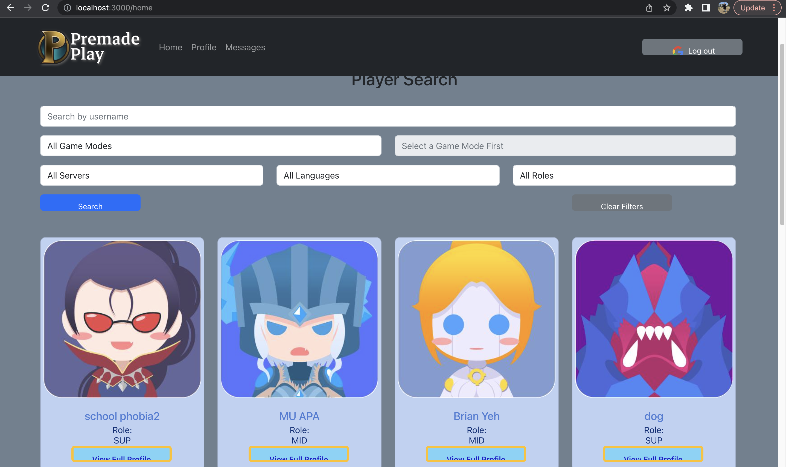

# TEAM404

## Project: Premade Play

## Description:

Web application that matches gamers in the MMO (massively multiplayer online) game league of legends (with possibility to add other/more games in the future). Our website will enable players to get matched and search for other players with complementary roles in a game.

### Database Tables:

Profile, Friends, Messages

### UI Routes / Pages:

HomePage, Personal Profile, Public User Profile, Messages
--------

## ITERATION 3:

 <strong>Backend Heroku deployment: </strong> https://premade-backend.herokuapp.com/api/v1/players/

 <strong>Frontend Heroku deployment: </strong> https://premade-play.herokuapp.com/

#### Shared Contributions:

* Collaborated on updated data structure
* Code review, updates, and edits

#### Brian Contribution:
* Created the registration page
* Updating individual player profile page
* Deployed backend to heroku and linked to MongoDb in Config Vars
* Debugged backend and frontend linking

#### Jeicy Contribution:
* Created the home page carousel
* Created the player card on the player list
* Updating player list of all players with multiple pages
* Updated deployed frontend and linked to backend in Config Vars
* Debugged backend and frontend linking

#### Challenges:

* Creating the better layout of player card at the frontend
* Fetching the user input data for storing and matching
* Further refining combined code and finishing up the frontend

### Frontend Homepage:
#### Home slide when having login:

#### Home when logged in with cards generated from backend:

#### Other player's profile:

#### Personal profile:

#### Reginstration:

## ITERATION 2:

#### Shared Contributions:

* Collaborated on updated data structure
* Code review, updates, and edits

#### Brian Contribution:

* Setup MongoDb online database and added players dummy data
* Updated backend data format and querying to better suit search functions in frontend
* Created individual player profile page
* Deployed backend to heroku and linked to MongoDb in Config Vars
* Debugged backend and frontend linking

#### Jeicy Contribution:

* Created player list of all players with multiple pages
* Implemented search functionality with multiple search criteria
* Updated players controller to better suit new data fetching
* Updated deployed frontend and linked to backend in Config Vars
* Debugged backend and frontend linking

#### Challenges:

* Matching backend data to frontend data and finding dummy data issues and fixes
* Props vs params figuring out the best use for each in our code
* Further refining combined code and finishing up the frontend

### Frontend Homepage:

#### Profile:

#### Home when logged in with cards generated from backend:

## ITERATION 1:

 <strong>Working Heroku deployment: </strong> https://premade-play.herokuapp.com/

#### Shared Contributions:

* Designed the database and shape of data
* Created a workplan and divided tasks

#### Brian Contribution: Backend:

* Setup github repo
* Started implementing backend
* Starter code for get player data and message date from MangoDB
* Developed mutifilter function at backend.

#### Jeicy Contribution: Frontend:

* Shaped github folder structure
* Started implementing frontend
* Starter code for login and logged out, webapp functions, and pages
* Deployed the frontend to heroku

#### Challenges:

* Getting backend and frontend to run and build on each other's devices
* Putting the backend in communication with the front end
* Further refining and combining code

### Frontend Homepage:

#### When logged in:

#### When logged out:

---------------

## ITERATION 1:

 <strong>Working Heroku deployment: </strong> https://premade-play.herokuapp.com/

#### Shared Contributions:

* Designed the database and shape of data
* Created a workplan and divided tasks

#### Brian Contribution: Backend:

* Setup github repo
* Started implementing backend
* Starter code for get player data and message date from MangoDB
* Developed mutifilter function at backend.

#### Jeicy Contribution: Frontend:

* Shaped github folder structure
* Started implementing frontend
* Starter code for login and logged out, webapp functions, and pages
* Deployed the frontend to heroku

#### Challenges:

* Getting backend and frontend to run and build on each other's devices
* Putting the backend in communication with the front end
* Further refining and combining code

### Frontend Homepage:

#### When logged in:

#### When logged out:

#### Initial empty profile:

#### Initial empty messages:

### Backend Date Retrieve:

#### Get player date:

#### Get palyer by id:

#### Get all the rank we have in data:

#### Get all the role we have in data:

#### Get all the server we have in data:

#### Get all the language we have in data:

#### Get message data:

